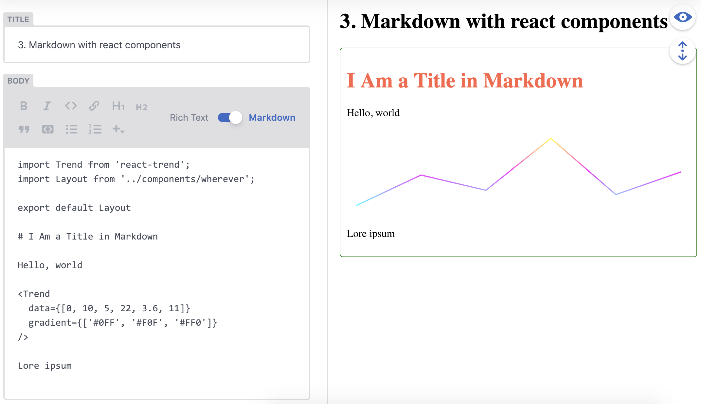

# netlify-cms-widget-mdx

[![npm version][version-badge]][version]
[![Build Status][build-badge]][build]
[![License: MIT][license-badge]][license]
[![module formats: cjs][module-formats-badge]][unpkg-bundle]

Experimental MDX file support in Netlify CMS.



## Install

```shell
npm i netlify-cms-widget-mdx
```

```js
import { MdxControl, MdxPreview } from 'netlify-cms-widget-mdx';

CMS.registerWidget('mdx', MdxControl, MdxPreview);
```

To setup scope, components and other props for [`@mdx-js/runtime`](https://www.npmjs.com/package/@mdx-js/runtime).
Also you can setup `allowedImports` for [mdx-scoped-runtime](https://www.npmjs.com/package/mdx-scoped-runtime)
that will inspect the import path and apply the scope if path is correct.

```js
import Trend from 'react-trend';
import { MdxControl, setupPreview } from 'netlify-cms-widget-mdx';
import Trend from 'react-trend';
import remarkEmojiPlugin from 'remark-emoji';

CMS.registerWidget(
  'mdx',
  MdxControl,
  setupPreview({
    components: {
      h1: ({ children, ...props }) => (
        <h1 style={{ color: 'tomato' }} {...props}>
          {children}
        </h1>
      ),
    },
    scope: {
      Layout: (props) => (
        <div
          style={{
            padding: '10px',
            border: '1px solid green',
            borderRadius: '5px',
          }}
          {...props}
        />
      ),
    },
    allowedImports: {
      'react-trend': {
        ImportDefault: Trend,
      },
    },
    mdPlugins: [remarkEmojiPlugin],
  })
);
```

## How to use

Add to your Netlify CMS configuration:

```yaml
extension: 'mdx',
format: 'frontmatter',
fields:
  - name: body
    label: Body
    widget: mdx
```

## License

MIT

## Support

For help with this widget, open an [issue](https://github.com/karolis-sh/gatsby-mdx)
or ask the Netlify CMS community in [Gitter](https://gitter.im/netlify/netlifycms).

[version-badge]: https://badge.fury.io/js/netlify-cms-widget-mdx.svg
[version]: https://www.npmjs.com/package/netlify-cms-widget-mdx
[build-badge]: https://travis-ci.org/karolis-sh/gatsby-mdx.svg?branch=main
[build]: https://travis-ci.org/karolis-sh/gatsby-mdx
[license-badge]: https://img.shields.io/badge/License-MIT-yellow.svg
[license]: https://opensource.org/licenses/MIT
[module-formats-badge]: https://img.shields.io/badge/module%20formats-cjs-green.svg
[unpkg-bundle]: https://unpkg.com/netlify-cms-widget-mdx/
